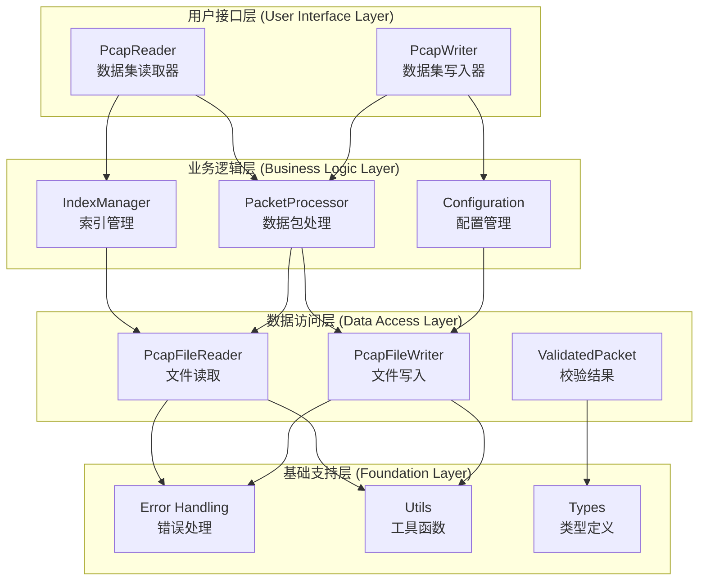
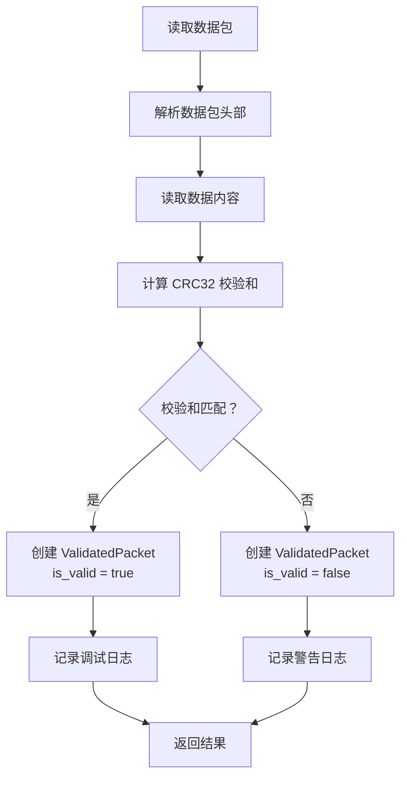
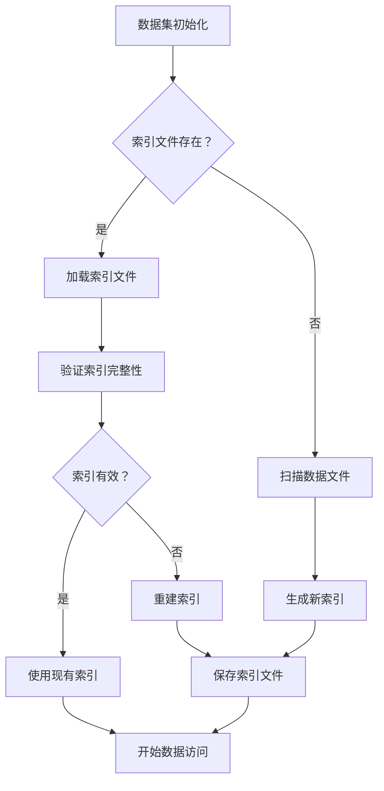

# PcapFile.IO 内部设计文档

本文档详细描述了 PcapFile.IO 库的内部架构设计，包括核心组件、数据流、错误处理机制等实现细节。

## 设计概述

### 核心设计理念

PcapFile.IO 基于以下核心设计理念构建：

- **数据完整性优先**: 默认进行 CRC32 校验，确保数据完整性
- **用户自主决策**: 提供校验结果，让用户决定如何处理损坏数据
- **高性能设计**: 零拷贝操作、批量处理、智能缓存
- **内存安全**: 利用 Rust 的内存安全保证
- **简洁 API**: 减少冗余接口，提供直观的用户体验
- **自动化管理**: 自动资源管理，减少用户干预

### 架构层次



## 核心数据结构

### ValidatedPacket - 带校验结果的数据包

```rust
pub struct ValidatedPacket {
    pub packet: DataPacket,
    pub is_valid: bool,
}

impl ValidatedPacket {
    pub fn new(packet: DataPacket, is_valid: bool) -> Self;
    pub fn is_valid(&self) -> bool;
    pub fn is_invalid(&self) -> bool;
    
    // 委托给内部数据包的方法
    pub fn packet_length(&self) -> usize;
    pub fn capture_time(&self) -> DateTime<Utc>;
    pub fn get_timestamp_ns(&self) -> u64;
    pub fn checksum(&self) -> u32;
}
```

**设计特点**:
- 包装原始数据包和校验结果
- 提供委托方法访问数据包属性
- 简化用户对校验结果的处理

### DataPacket - 数据包结构

```rust
pub struct DataPacket {
    pub header: DataPacketHeader,
    pub data: Vec<u8>,
}

impl DataPacket {
    pub fn from_datetime(capture_time: DateTime<Utc>, data: Vec<u8>) -> Result<Self, String>;
    pub fn from_timestamp(timestamp_seconds: u32, timestamp_nanoseconds: u32, data: Vec<u8>) -> Result<Self, String>;
    pub fn is_valid(&self) -> bool;  // 内部校验方法
}
```

### 文件格式规范

#### PCAP 文件头部（16 字节）

| 偏移量 | 长度 | 字段名 | 描述 |
|--------|------|--------|------|
| 0 | 4 | Magic Number | 固定值 `0xD4C3B2A1` |
| 4 | 2 | Major Version | 主版本号 `0x0002` |
| 6 | 2 | Minor Version | 次版本号 `0x0004` |
| 8 | 4 | Timezone Offset | 时区偏移量（秒） |
| 12 | 4 | Timestamp Accuracy | 时间戳精度（纳秒） |

#### 数据包头部（16 字节）

| 偏移量 | 长度 | 字段名 | 描述 |
|--------|------|--------|------|
| 0 | 4 | Timestamp Seconds | 时间戳秒部分（UTC） |
| 4 | 4 | Timestamp Nanoseconds | 时间戳纳秒部分（UTC） |
| 8 | 4 | Packet Length | 数据包长度（字节） |
| 12 | 4 | Checksum | 数据包校验和（CRC32） |

## API 设计

### 读取器 API

#### 默认方法（推荐使用）

```rust
impl PcapReader {
    // 默认方法：返回带校验结果的数据包
    pub fn read_packet(&mut self) -> PcapResult<Option<ValidatedPacket>>;
    pub fn read_packets(&mut self, count: usize) -> PcapResult<Vec<ValidatedPacket>>;
}
```

#### 便捷方法

```rust
impl PcapReader {
    // 仅返回数据包，不返回校验信息
    pub fn read_packet_data_only(&mut self) -> PcapResult<Option<DataPacket>>;
    pub fn read_packets_data_only(&mut self, count: usize) -> PcapResult<Vec<DataPacket>>;
}
```

**设计原则**:
- 默认方法返回校验结果，鼓励用户关注数据完整性
- 提供便捷方法满足不关心校验结果的场景
- 所有方法都进行校验计算，只是返回方式不同

### 写入器 API

```rust
impl PcapWriter {
    pub fn write_packet(&mut self, packet: &DataPacket) -> PcapResult<()>;
    pub fn write_packets(&mut self, packets: &[DataPacket]) -> PcapResult<()>;
    pub fn flush(&mut self) -> PcapResult<()>;
    // finalize() 在 Drop 时自动调用
}
```

## 数据校验机制

### 校验流程



### 校验策略

1. **总是校验**: 所有数据包都进行 CRC32 校验计算
2. **结果反馈**: 通过 `ValidatedPacket.is_valid` 返回校验结果
3. **用户决策**: 用户根据校验结果自主决定处理方式
4. **日志记录**: 校验失败时记录警告日志，便于调试

### 错误处理策略

```rust
// 推荐的处理方式
while let Some(validated_packet) = reader.read_packet()? {
    if validated_packet.is_valid() {
        // 处理有效数据包
        process_valid_packet(&validated_packet.packet);
    } else {
        // 用户决定如何处理损坏数据包
        match handle_corrupted_data_strategy() {
            Strategy::Skip => continue,
            Strategy::LogAndContinue => {
                log::warn!("跳过损坏数据包: {}", validated_packet.capture_time());
                continue;
            },
            Strategy::UseAnyway => {
                process_packet(&validated_packet.packet);
            }
        }
    }
}
```

## 配置管理

### CommonConfig - 通用配置

```rust
pub struct CommonConfig {
    pub buffer_size: usize,             // 缓冲区大小（字节）
    pub max_packet_size: usize,         // 最大数据包大小（字节）
    pub enable_compression: bool,       // 是否启用压缩
    pub index_cache_size: usize,        // 索引缓存大小（条目数）
    pub enable_index_cache: bool,       // 是否启用文件索引缓存
    pub temp_directory: PathBuf,        // 临时目录路径
}
```

### ReaderConfig - 读取器配置

```rust
pub struct ReaderConfig {
    pub common: CommonConfig,
    pub read_timeout: u64,              // 读取超时时间（毫秒）
}

impl ReaderConfig {
    pub fn default() -> Self;
    pub fn high_performance() -> Self;  // 高性能配置
    pub fn low_memory() -> Self;        // 低内存配置
}
```

### WriterConfig - 写入器配置

```rust
pub struct WriterConfig {
    pub common: CommonConfig,
    pub max_packets_per_file: usize,    // 每个文件最大数据包数
    pub file_name_format: String,       // 文件命名格式
    pub auto_flush: bool,               // 自动刷新
    pub write_timeout: u64,             // 写入超时时间（毫秒）
    pub index_flush_interval: u64,      // 索引刷新间隔（毫秒）
}

impl WriterConfig {
    pub fn default() -> Self;
    pub fn high_performance() -> Self;  // 高性能配置
    pub fn low_memory() -> Self;        // 低内存配置
    pub fn fast_write() -> Self;        // 快速写入配置
}
```

## 索引系统

### PIDX 索引文件格式

索引文件采用 XML 格式，包含以下信息：

```xml
<?xml version="1.0" encoding="UTF-8"?>
<pidx_index>
    <version>1.0</version>
    <description>PCAP数据集索引</description>
    <created_time>2023-12-01T12:00:00Z</created_time>
    <start_timestamp>1701432000000000000</start_timestamp>
    <end_timestamp>1701432060000000000</end_timestamp>
    <total_packets>1000</total_packets>
    <total_duration>60000000000</total_duration>
    <files>
        <file>
            <file_name>data_20231201_120000_000000001.pcap</file_name>
            <file_hash>sha256:abc123...</file_hash>
            <file_size>1024000</file_size>
            <packet_count>1000</packet_count>
            <start_timestamp>1701432000000000000</start_timestamp>
            <end_timestamp>1701432060000000000</end_timestamp>
            <packets>
                <packet>
                    <timestamp_ns>1701432000000000000</timestamp_ns>
                    <byte_offset>16</byte_offset>
                    <packet_size>1024</packet_size>
                </packet>
                <!-- 更多数据包条目 -->
            </packets>
        </file>
        <!-- 更多文件条目 -->
    </files>
</pidx_index>
```

### 索引管理流程



## 缓存系统

### 文件信息缓存

```rust
pub struct FileInfoCache {
    cache: HashMap<PathBuf, CacheItem>,
    max_entries: usize,
    stats: CacheStats,
}

struct CacheItem {
    file_info: FileInfo,
    cache_time: DateTime<Utc>,
    access_count: u64,
}
```

### 缓存策略

1. **LRU 淘汰**: 当缓存满时，淘汰最近最少使用的条目
2. **自动失效**: 基于文件大小和修改时间变化自动失效
3. **统计信息**: 提供详细的缓存命中率和性能统计

## 错误处理机制

### 错误类型体系

```rust
#[derive(Error, Debug)]
pub enum PcapError {
    #[error("文件未找到: {0}")]
    FileNotFound(String),
    
    #[error("目录不存在: {0}")]
    DirectoryNotFound(String),
    
    #[error("权限不足: {0}")]
    InsufficientPermissions(String),
    
    #[error("数据包损坏: {0}")]
    CorruptedData(String),
    
    #[error("数据包大小无效: {0}")]
    InvalidPacketSize(String),
    
    #[error("IO错误: {0}")]
    Io(#[from] std::io::Error),
    
    // 更多错误类型...
}
```

### 错误处理策略

1. **分层处理**: 在每一层进行适当的错误处理和转换
2. **错误传播**: 使用 `Result` 类型确保错误正确传播
3. **详细信息**: 提供详细的错误信息帮助调试
4. **恢复机制**: 在可能的情况下提供错误恢复机制

## 性能优化

### 内存管理

- **零拷贝操作**: 尽可能避免不必要的数据复制
- **缓冲区复用**: 复用缓冲区减少内存分配开销
- **智能缓存**: 使用 LRU 缓存提高访问性能

### I/O 优化

- **批量操作**: 支持批量读写操作减少系统调用
- **异步刷新**: 支持异步刷新操作避免阻塞
- **预读取**: 实现预读取机制提高读取性能

### 算法优化

- **二分查找**: 在有序数据中使用二分查找
- **哈希表**: 使用哈希表进行快速查找
- **缓存友好**: 设计缓存友好的数据结构和算法

## 线程安全设计

### 并发访问控制

```rust
pub struct PcapReader {
    // 使用内部可变性模式
    inner: RefCell<PcapReaderInner>,
}

struct PcapReaderInner {
    current_reader: Option<PcapFileReader>,
    current_file_index: usize,
    // 其他字段...
}
```

### 线程安全保证

1. **不可变引用**: 尽可能使用不可变引用避免竞争条件
2. **内部可变性**: 使用 `RefCell` 等内部可变性模式
3. **生命周期管理**: 正确管理对象生命周期避免悬空引用

## 测试策略

### 单元测试

- **模块测试**: 为每个模块编写完整的单元测试
- **边界条件**: 测试边界条件和异常情况
- **性能测试**: 进行性能基准测试

### 集成测试

- **端到端测试**: 测试完整的读写流程
- **数据一致性**: 验证数据写入和读取的一致性
- **错误处理**: 测试各种错误情况的处理

### 测试覆盖

```rust
// 示例：数据一致性测试
#[test]
fn test_data_consistency() {
    let test_data = create_test_dataset();
    
    // 写入数据
    let mut writer = PcapWriter::new("./test", "dataset", WriterConfig::default())?;
    for packet in &test_data {
        writer.write_packet(packet)?;
    }
    writer.flush()?;
    
    // 读取并验证数据
    let mut reader = PcapReader::new("./test", "dataset", ReaderConfig::default())?;
    let mut read_data = Vec::new();
    
    while let Some(validated_packet) = reader.read_packet()? {
        assert!(validated_packet.is_valid(), "数据包校验失败");
        read_data.push(validated_packet.packet);
    }
    
    assert_eq!(test_data.len(), read_data.len());
    // 进一步验证数据内容...
}
```

## 扩展性设计

### 模块化架构

- **分层设计**: 采用分层架构便于功能扩展
- **接口抽象**: 使用 trait 定义清晰的接口
- **版本兼容**: 保持向后兼容性

### 协议演进

- **版本化设计**: 支持协议版本演进
- **向后兼容**: 确保新版本能够处理旧格式数据
- **迁移工具**: 提供数据格式迁移工具

## 部署和运维

### 性能监控

- **缓存统计**: 监控缓存命中率和性能
- **错误统计**: 统计各种错误类型的发生频率
- **资源使用**: 监控内存和 CPU 使用情况

### 日志系统

```rust
// 使用 log crate 进行日志记录
log::debug!("读取数据包，当前计数: {}", packet_count);
log::warn!("数据包校验失败。期望: 0x{:08X}, 实际: 0x{:08X}", expected, actual);
log::error!("文件读取失败: {}", error);
```

### 配置管理

- **环境变量**: 支持通过环境变量配置
- **配置文件**: 支持配置文件方式配置
- **运行时调整**: 支持运行时配置调整

## 总结

PcapFile.IO 的内部设计遵循以下原则：

1. **数据完整性优先**: 默认进行校验，确保数据质量
2. **用户自主决策**: 提供校验结果，让用户决定处理策略
3. **高性能设计**: 通过缓存、批量操作等优化性能
4. **简洁易用**: 提供直观的 API 和自动化管理
5. **可扩展性**: 模块化设计便于功能扩展
6. **可靠性**: 完善的错误处理和恢复机制

这种设计既保证了数据的安全性和完整性，又提供了高性能和良好的用户体验。